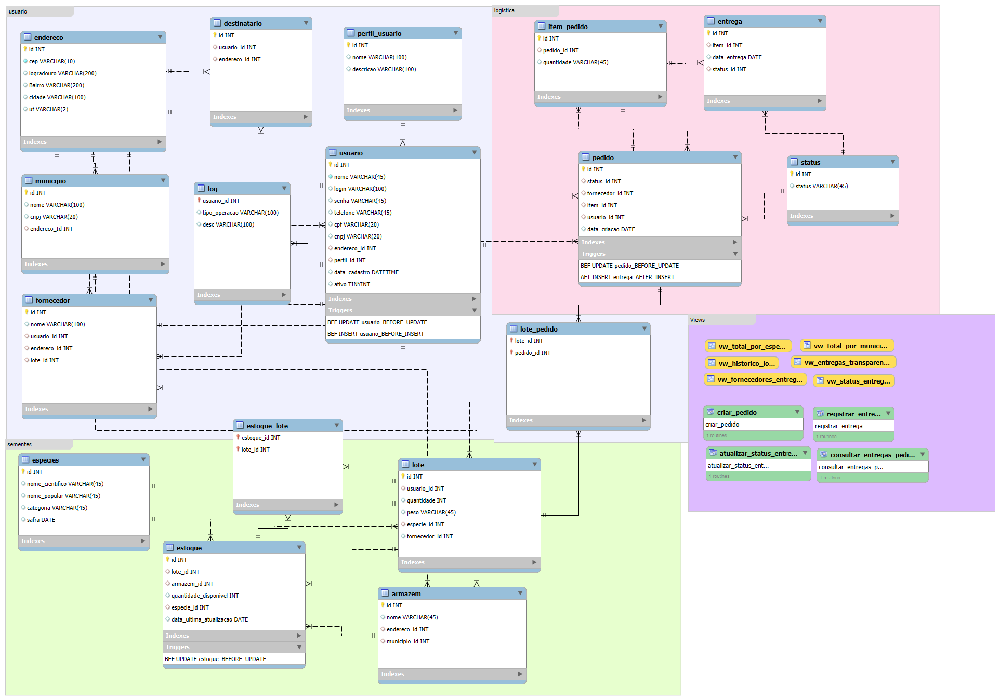

# 🌱 Banco de Dados – Programa de Aquisição e Distribuição de Sementes

Este repositório contém o **modelo de banco de dados MySQL** do sistema do **Programa de Aquisição e Distribuição de Sementes**, voltado para o controle de **lotes, pedidos, entregas, fornecedores e estoques**, garantindo **transparência e eficiência** na gestão pública de sementes.

---

## 🧭 Objetivo

O banco de dados foi projetado para:
- Gerenciar **lotes de sementes** desde o fornecedor até a entrega final;
- Controlar **estoques por armazém** e **quantidades disponíveis**;
- Registrar **pedidos e entregas**, com atualização automática via triggers;
- Garantir **validações e integridade dos dados** com procedimentos e restrições;
- Fornecer **views analíticas** para relatórios e dashboards de transparência.

---

## ⚙️ Regras de Negócio (Triggers)

| Trigger | Função |
|----------|--------|
| **usuario_BEFORE_INSERT / UPDATE** | Impede cadastro com CPF e CNPJ juntos (ou nenhum dos dois) |
| **estoque_BEFORE_UPDATE** | Bloqueia saldo negativo de estoque |
| **pedido_BEFORE_UPDATE** | Impede finalizar pedido sem itens |
| **entrega_AFTER_INSERT** | Atualiza estoque automaticamente após nova entrega |

Essas triggers garantem **integridade e coerência dos dados**.

---

## 🧠 Procedures Criadas

| Procedure | Descrição |
|------------|------------|
| **criar_pedido** | Cria novo pedido e retorna o ID gerado |
| **criar_ordem_expedicao** | Registra uma nova ordem de expedição |
| **registrar_entrega** | Registra entrega e valida a data (não permite datas futuras) |
| **atualizar_status_entrega** | Atualiza o status de uma entrega existente |
| **consultar_entregas_pedido** | Lista todas as entregas associadas a um pedido |

Esses procedimentos ajudam a **automatizar as operações do sistema**.

---

## 📊 Views Criadas

| View | Função |
|------|--------|
| **vw_total_por_especie** | Total distribuído por espécie de semente |
| **vw_total_por_municipio** | Total distribuído por município |
| **vw_historico_lote** | Histórico de entrada e saída por lote |
| **vw_entregas_transparencia** | Consulta pública de entregas com município e status |
| **vw_fornecedores_entregas** | Total de entregas realizadas por fornecedor |
| **vw_status_entregas** | Quantidade de entregas por status |

Essas views são ideais para **dashboards e relatórios de transparência pública**.

---

## 🗂️ DER (Diagrama Entidade-Relacionamento)

  

---

## 💡 Tecnologias Utilizadas
- **MySQL Workbench** – Modelagem e geração do script SQL.  
- **MySQL Server** – Execução e gerenciamento do banco.  
- **Git & GitHub** – Controle de versão e colaboração.  

---

## 👩‍💻 Autoria
Projeto desenvolvido por **Lorena Lira**, **Ricardo Rafael** e **Maria Clara** 💚  
Acadêmicos de **Análise e Desenvolvimento de Sistemas**.

---

## 🪴 Licença
Este projeto é de uso acadêmico. Você pode consultar, estudar e adaptar livremente, desde que mantenha os créditos do autor.
